<div align="center">

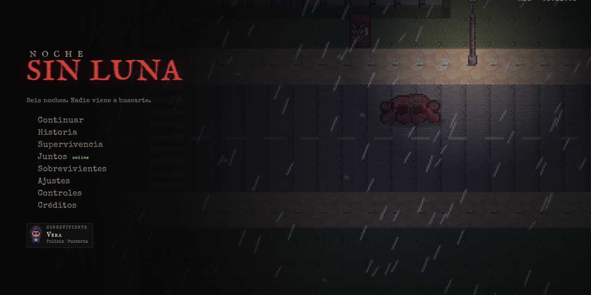

# Noche Sin Luna

**Supervivencia zombie top-down en pixel art, para jugar solo o con hasta 3 amigos online.**

Un juego de [Dev-Sot](https://github.com/Dev-Sot).

[](https://zombie-night.vercel.app)


</div>

---

Nueve noches en tres mundos, con principio y final. En **la ciudad**,
devolvé la electricidad al barrio, pedí ayuda por radio y resistí hasta que
llegue el helicóptero. En **el hospital**, el helicóptero cae frente al San
Rafael: entrá a oscuras, rescatá a Lucía y escapá del Paciente Cero. En
**el puerto**, un barco sale al amanecer: mové un contenedor con la grúa,
volvé a encender el faro en medio de la tormenta y resistí en el muelle
mientras, por primera vez en toda la historia, sale el sol.

<table>
  <tr>
    <td>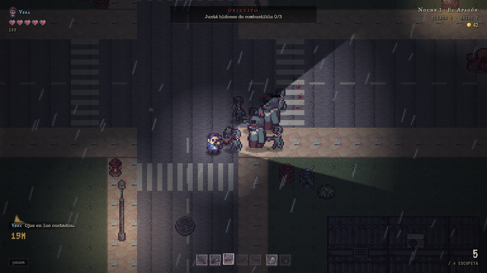</td>
    <td>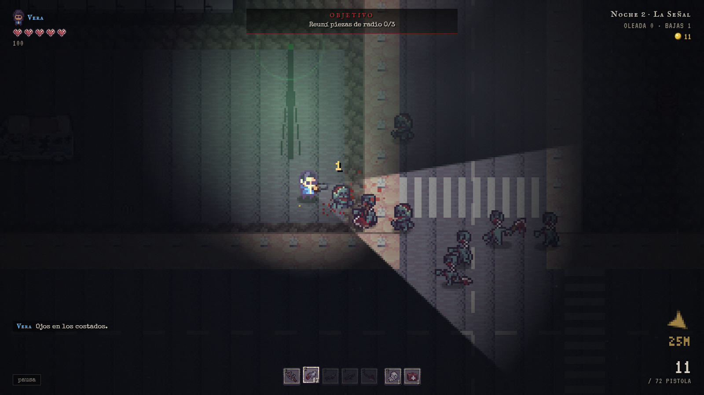</td>
  </tr>
  <tr>
    <td align="center"><b>Noche 1 · El Apagón</b><br>Barrio bajo la lluvia</td>
    <td align="center"><b>Noche 2 · La Señal</b><br>El centro, cubierto de niebla</td>
  </tr>
  <tr>
    <td>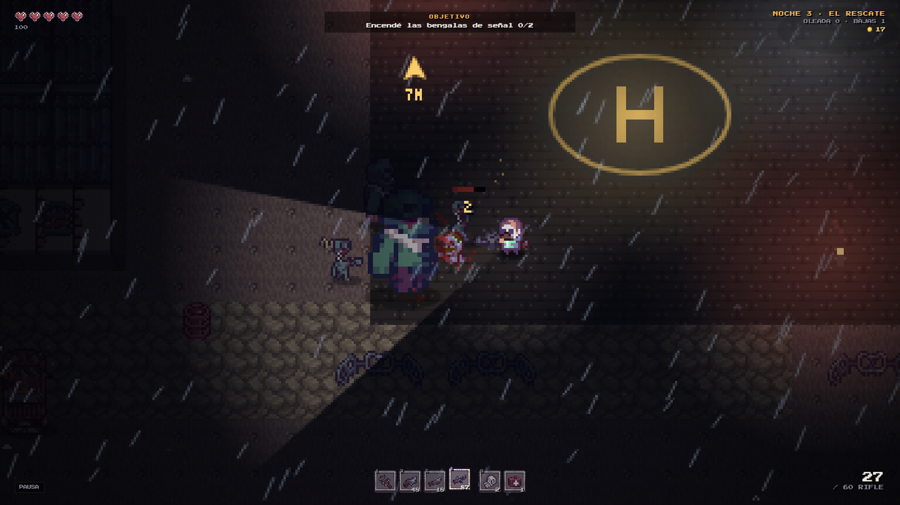</td>
    <td>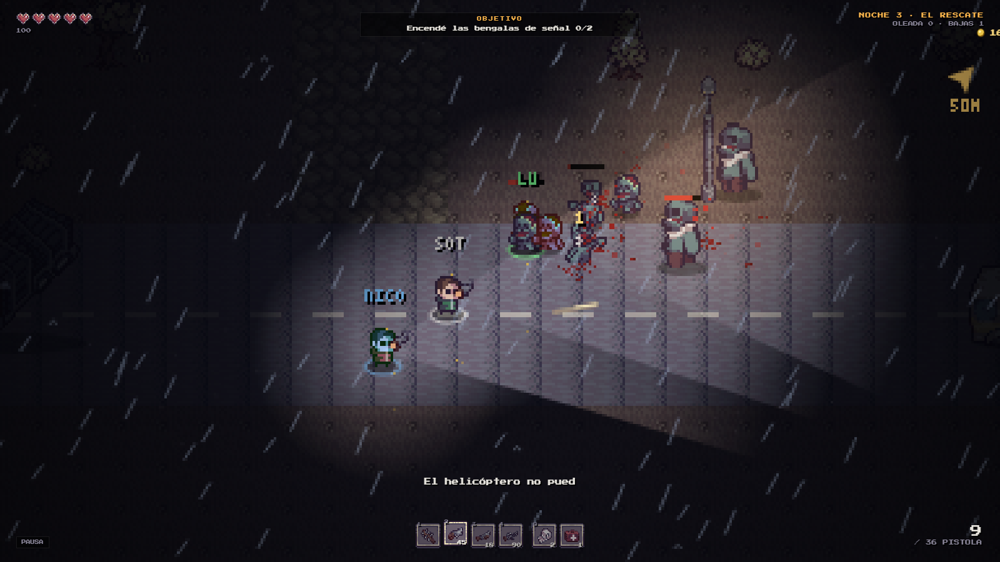</td>
  </tr>
  <tr>
    <td align="center"><b>Noche 3 · El Rescate</b><br>Tormenta, el Gigante y el helicóptero</td>
    <td align="center"><b>Juntos</b><br>Cooperativo online de 2 a 4 jugadores</td>
  </tr>
  <tr>
    <td>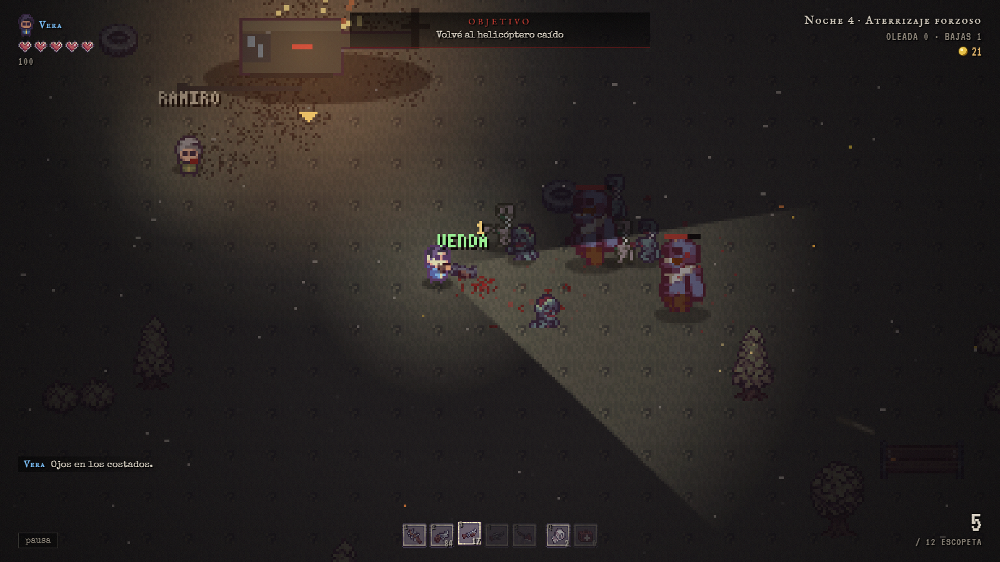</td>
    <td>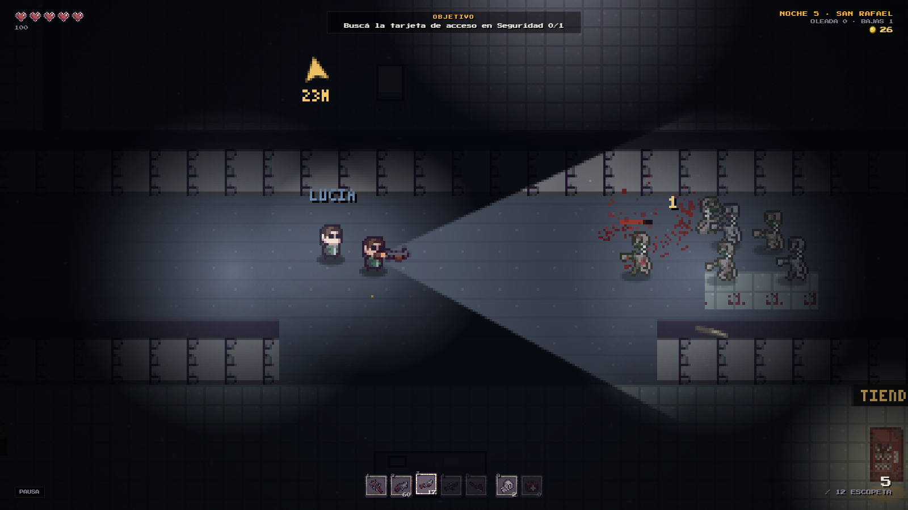</td>
  </tr>
  <tr>
    <td align="center"><b>Noche 4 · Aterrizaje forzoso</b><br>El helicóptero en llamas, bajo la ceniza</td>
    <td align="center"><b>Noche 5 · San Rafael</b><br>Adentro del hospital con Lucía</td>
  </tr>
  <tr>
    <td>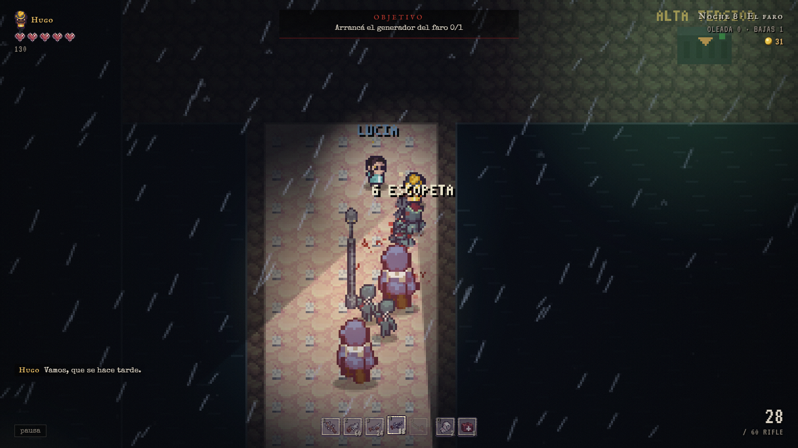</td>
    <td>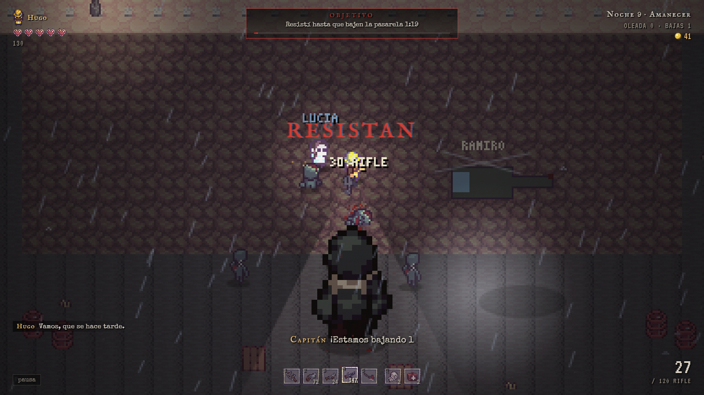</td>
  </tr>
  <tr>
    <td align="center"><b>Noche 8 · El faro</b><br>La escollera en la tormenta</td>
    <td align="center"><b>Noche 9 · Amanecer</b><br>El Coloso, Ramiro y el final</td>
  </tr>
  <tr>
    <td>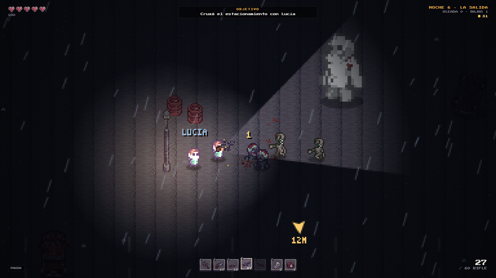</td>
    <td>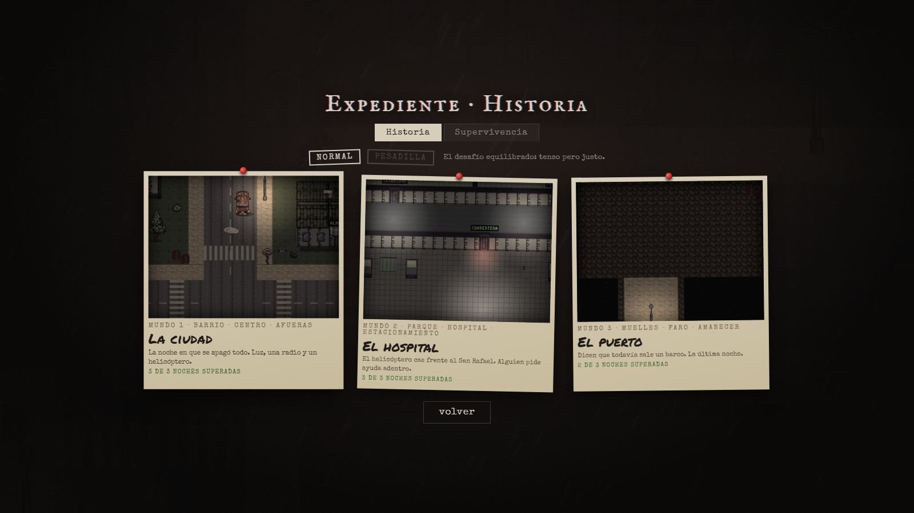</td>
  </tr>
  <tr>
    <td align="center"><b>Noche 6 · La salida</b><br>El Paciente Cero</td>
    <td align="center"><b>El expediente</b><br>Tres mundos, historia y supervivencia</td>
  </tr>
  <tr>
    <td>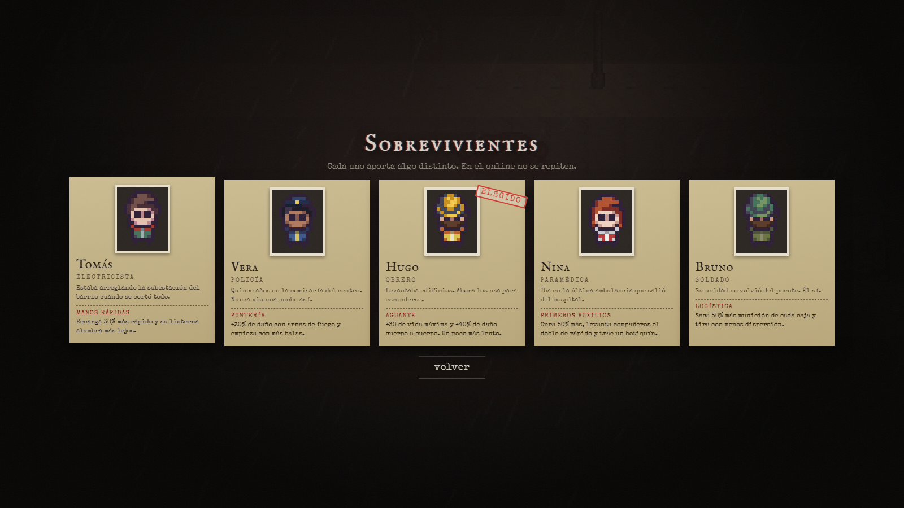</td>
    <td>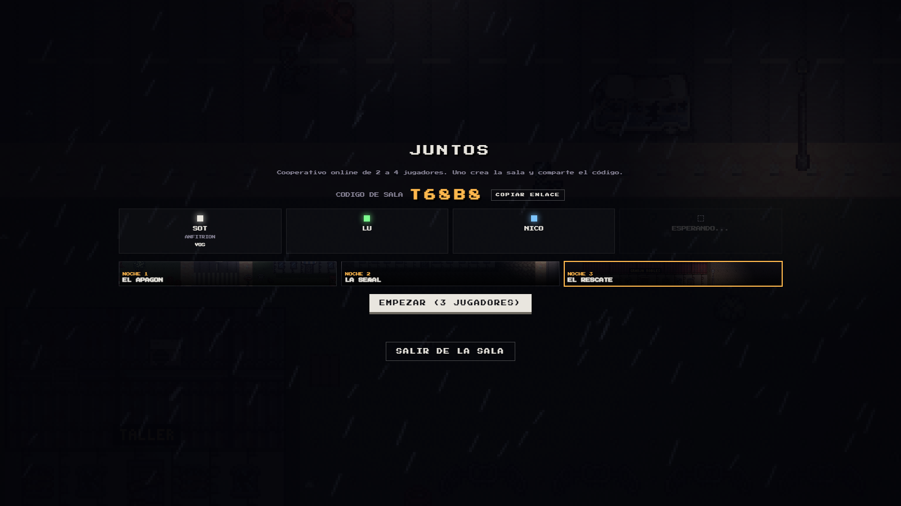</td>
  </tr>
  <tr>
    <td align="center"><b>Sobrevivientes</b><br>Cinco personajes con habilidad propia</td>
    <td align="center"><b>La sala online</b><br>Cada jugador elige su sobreviviente</td>
  </tr>
</table>

## Características

- **Nueve noches con historia en tres mundos** y un final: objetivos por pasos (juntar,
  llevar, activar, defender, rescatar, escoltar, jefe final) en vez de
  oleadas infinitas.
- **Interiores**: edificios a los que se entra (el techo desaparece),
  puertas que se abren con E, puertas con tarjeta o que necesitan energía,
  armarios para revisar y zombies que rompen las puertas.
- **Sobrevivientes**: Lucía te sigue por el mapa, los zombies también la
  atacan y si muere se pierde la noche.
- **Cooperativo online de 2 a 4 jugadores**: uno crea una sala, comparte un
  código de 5 letras (o un enlace) y el resto se une desde el navegador. Si
  un compañero cae, se lo revive manteniendo **E** a su lado. Chat de sala y
  marcas en el mapa para coordinar.
- **Dos dificultades**: Normal y **Pesadilla** (zombies más duros y rápidos,
  menos balas, todo más caro), con mejor rango guardado para cada una.
- **Modo supervivencia**: oleadas infinitas en los tres mapas, el Gigante cada
  10 oleadas, suministros cada 5 y récord por mapa y dificultad.
- **Cinco sobrevivientes jugables**, cada uno con su oficio, su historia y
  una habilidad propia: Tomás (electricista), Vera (policía), Hugo (obrero),
  Nina (paramédica) y Bruno (soldado). Hablan durante la partida y en el
  online no se repiten, como en Left 4 Dead.
- **Interfaz de horror cinematográfico**: menú como cámara de seguridad VHS,
  noches como fotos Polaroid de un expediente, fichas de los sobrevivientes,
  tarjetas de capítulo antes de cada noche e informe mecanografiado al final.
- **Teclado y mouse, joystick o celular**: controles de doble stick con
  joystick y joysticks táctiles en el teléfono.
- **Presentación cinematográfica**: franjas de cine, travelling de cámara al
  objetivo, subtítulos, cámara lenta, viñeta y grano de película, y
  resultados con rango C / B / A / S.
- **Arsenal e inventario**: bate, hacha, pistola, escopeta y rifle automático
  con el arma visible en la mano. Las armas se encuentran o se compran: no
  vienen todas de entrada.
- **Diez tipos de zombie**: caminante, enfermero, corredor, lanzador de
  hachas, bruto, tóxico, **gritón** (llama a la horda), **hinchado** (revienta
  en gas tóxico) y tres jefes: el Gigante, el **Paciente Cero** y **El Coloso**.
- **Escenarios con agua, grúas y faros**: el puerto tiene mar que no se puede
  cruzar, un faro cuyo haz barre el mapa, una grúa que abre el camino y un
  amanecer que va levantando la oscuridad durante la última pelea. Rodean los edificios buscando el camino más corto.
- **Mapas en perspectiva 3/4**: calles, veredas, cruces peatonales, edificios
  con techo y fachada, autos como cobertura y barriles que explotan en cadena.
- **Iluminación dinámica**: linterna, faroles que titilan, fogonazos, bengalas
  y relámpagos.
- **Sonido real**: disparos grabados de armas reales, zombies, recargas y
  música que cambia entre exploración, combate y jefe (todo CC0), con
  síntesis procedural de respaldo.

## Cómo jugar

| Tecla | Acción |
|---|---|
| **WASD** | moverse |
| **Mouse / clic** | apuntar / disparar |
| **Espacio** | esquivar |
| **R** | recargar |
| **1-5 / rueda** | cambiar arma |
| **Q** | curarse |
| **E** | interactuar / abrir puertas / revisar armarios / tienda |
| **Mantener E** | revivir a un compañero |
| **F** | linterna |
| **G / clic del medio** | marcar un lugar |
| **T / Enter** | chat (online) |
| **ESC** | pausa |

**Joystick:** stick izquierdo mueve, derecho apunta, RT dispara, A usar,
B esquivar, X recargar, Y curar, LB/RB cambian de arma, Start pausa.
**Celular:** joystick izquierdo para moverse, derecho para apuntar y disparar,
botones de acción a la derecha.

### Jugar con amigos

1. En el menú principal, entrá a **JUNTOS** y tocá **CREAR SALA**.
2. Pasale el código (o el botón **COPIAR ENLACE**) a tus amigos.
3. Ellos entran a **JUNTOS**, escriben el código y tocan **UNIRSE**.
4. El anfitrión elige modo (historia o supervivencia), noche y dificultad, y toca **EMPEZAR**.

No hace falta cuenta ni instalar nada. La conexión es directa entre
navegadores (WebRTC); el anfitrión simula la partida y los demás reciben el
estado unas 20 veces por segundo, con predicción local del movimiento.

## Desarrollo

El juego no tiene build ni dependencias: son módulos ES nativos servidos como
archivos estáticos. Hace falta un servidor local (abrir `index.html` directo no
funciona por los módulos):

```bash
npm run dev          # npx serve .
# o
python -m http.server 8080
```

`npm run check` verifica la sintaxis de todos los módulos.

### Estructura

```
index.html, styles.css   interfaz (menús, HUD, sala) en DOM
src/main.js              arranque: carga de sprites, UI y bucle
src/core/                motor: render, input, audio, assets, guardado
src/game/                juego: mundo, jugador, armas, zombies, objetivos, niveles,
                         dificultad, supervivencia, marcas
src/net/                 multijugador: salas (net.js) y snapshots (sync.js)
src/ui/ui.js             menús, HUD, tienda, subtítulos, sala
assets/                  sprites y audio opcional
docs/                    capturas
tools/                   importadores de sprites y audio, chequeo de sintaxis
```

Los niveles son datos en [`src/game/levels.js`](src/game/levels.js): un nivel
nuevo se arma describiendo calles, edificios, props, spawns y su lista de
objetivos.

### Arquitectura en breve

- **Bucle de paso fijo a 60 Hz** con acumulador, cámara lenta (`timeScale`) y
  hitstop.
- **Resolución interna de 384×216** escalada sin suavizado; HUD y menús en DOM
  encima del canvas.
- **Orden por profundidad** (painter's algorithm por la línea de los pies) y
  colisión por hash espacial.
- **Pathfinding por campo de flujo**: un BFS desde todos los jugadores cada
  1/3 de segundo, que los zombies siguen cuesta abajo.
- **Red autoritativa del anfitrión**: los clientes mandan input; el anfitrión
  manda snapshots compactos y los efectos (sangre, explosiones, sonidos) como
  eventos que cada cliente reproduce.

## Despliegue

Cada push a `main` se despliega automáticamente en Vercel como sitio estático.

## Roadmap

Ver [ROADMAP.md](ROADMAP.md) y el historial en [CHANGELOG.md](CHANGELOG.md).

## Créditos

- Dirección, diseño y desarrollo: [Dev-Sot](https://github.com/Dev-Sot).
- Personajes, zombies, armas y escenarios: *Post-Apocalypse Pixel Art Asset
  Pack* por [TheLazyStone](https://thelazystone.itch.io/post-apocalypse-pixel-art-asset-pack).
- Objetos recogibles: *Zombie Apocalypse Tileset* por
  [Ittai Manero](https://ittaimanero.itch.io/zombie-apocalypse-tileset).
- Disparos: *The Free Firearm Sound Library* (Jaszczak, Nelson, Heras, Nanney) · CC0.
- Zombies: *Zombies Sound Pack* (Summoning Wars) · CC0. Recargas: *Gun Reload Sounds* · CC0.
- Música (CC0): *Chill Main Menu Music* de Augmentality, *Post Apocalyptic
  Wastelands* de Juhani Junkala, *Determined Pursuit* de Emma_MA y *Dramatic
  Boss Encounter* de cynicmusic, todas vía [OpenGameArt](https://opengameart.org).
- Mobiliario y pisos del hospital: dibujados para el juego con
  `tools/make_interior.py`, usando la paleta del pack principal.
- Sobrevivientes: variantes del personaje del pack armadas con
  `tools/make_characters.py` (paletas propias y el casco del pack).
- Tipografías: *IM Fell English SC*, *Special Elite*, *VT323* y *Permanent
  Marker* (Google Fonts, SIL Open Font License).
- Fuente: *Press Start 2P* por CodeMan38 (SIL Open Font License).
- Conexiones en red: [PeerJS](https://peerjs.com) (MIT).

## Licencia

El código es [MIT](LICENSE). Los sprites pertenecen a sus autores y se usan
según las licencias de sus packs; no están cubiertos por la licencia MIT.
